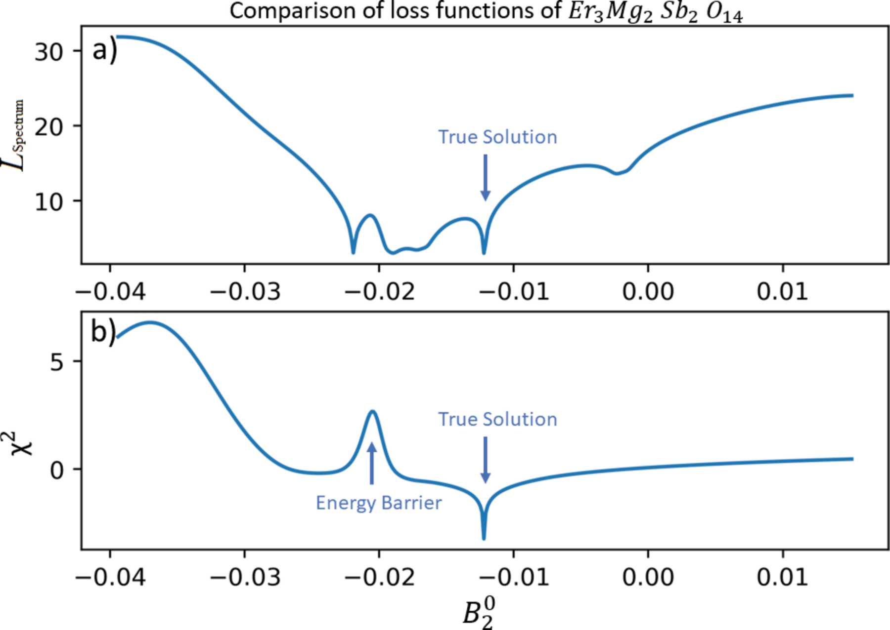
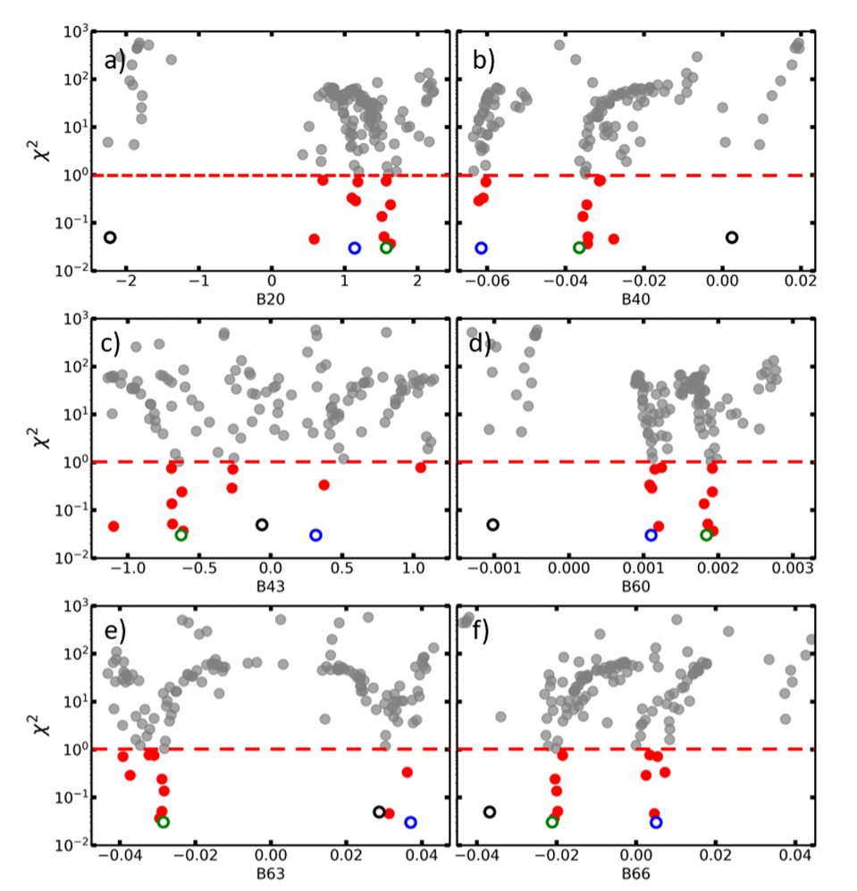

# CrysFieldExplorer

1.0.0 version is released. To install:

```pip install CrysFieldExplorer```

CrysFieldExplorer is a fast-converging Python package for optimizing crystal field parameters.

It supports calculation of a list of common rare earth ions. The program consists of three major modules: CrysfieldExplorer(main), Optimization and Visulization. Detailed tutorials will be uploaded soon.


The novalty of CrysFieldExplorer is it adopts a new loss function using theory of characteristic polynomials. By adopting this loss function it can globaly optimize the CEF hamiltonian with Neutron + any other experimental data and does not rely much on accurate starting value, which is usually estimated from point charge models.

A comparsion of the new Spectrum-Characteristic loss ($L_{spectrum}$) and traditional $\chi^2$ loss has been displayed below.

The details of this program can be found at https://scripts.iucr.org/cgi-bin/paper?S1600576723005897.




A comparison of the new loss function $L_{spectrum}$ vs traditional $\chi^2$ loss along a random line in a 15 dimensional parameter space.

This repo is organized with two types of examples corresponding to two types of optimization methods, Particle Swarm Optimization (PSO) and Covariance Matrix Adaptation Evolution Strategy (CMA-ES)  used in conjunction with $L_{spectrum}. Generally speaking, when dealing with < 8 CEF parameters, PSO is a good choice for accuracy and for >=8 CEF parameters CMA-ES has shown significant gain in optimizing speed. In both types of examples the codes are desgined with being able to run parallel using mpi4py in mind.

# Example 1 Yb2Ti2O7

The Yb2Ti2O7 is a classical example with 6 CEF parameters, traditional algorithms requires estimation of point charge model to provide insight. With CrysFieldExplorer, it can search large parameter phase space and provide a cluster of solutions of all 6 CEF parameters.



From these solutions it can produce excellent agreement between physical measured data and theoretical predictions.


